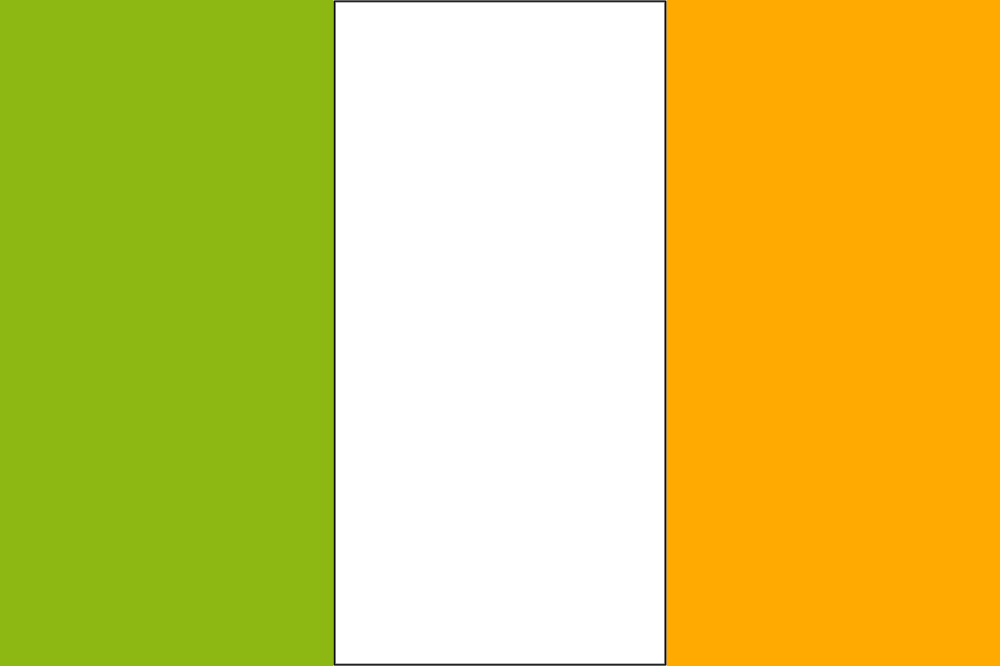
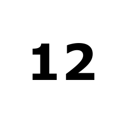
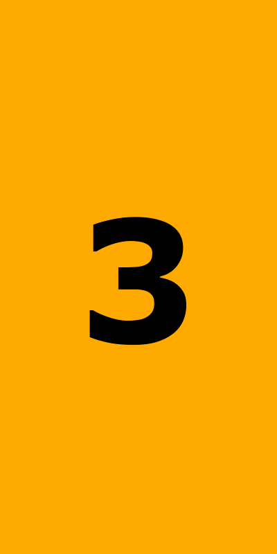
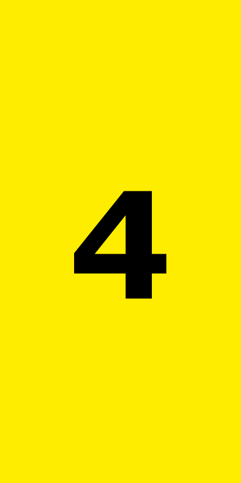
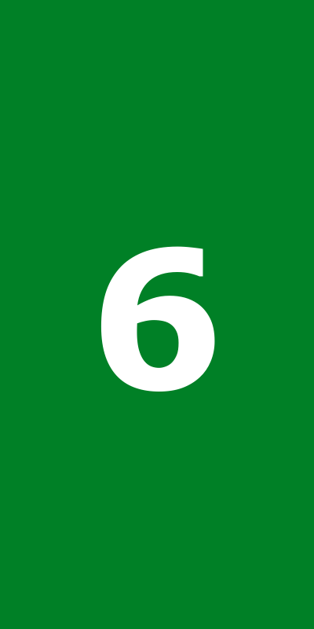
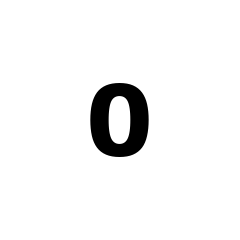

# Three Stripe Clock

## Example

| 5:03 |
| --- |
|  |

## The first stripe is the hour:

 &nbsp;&nbsp;&nbsp;&nbsp;    &nbsp;&nbsp;&nbsp;&nbsp;    &nbsp;&nbsp;&nbsp;&nbsp;    &nbsp;&nbsp;&nbsp;&nbsp;  

## The middle and last stripes show the minutes, one number at a time. For example, 03 is white then orange:

 &nbsp;&nbsp;&nbsp;&nbsp;    &nbsp;&nbsp;&nbsp;&nbsp;    &nbsp;&nbsp;&nbsp;&nbsp;   

## ☞ [_Live preview_](https://htmlpreview.github.io/?https://github.com/gatewaycat/color-clock/blob/main/index.html)
