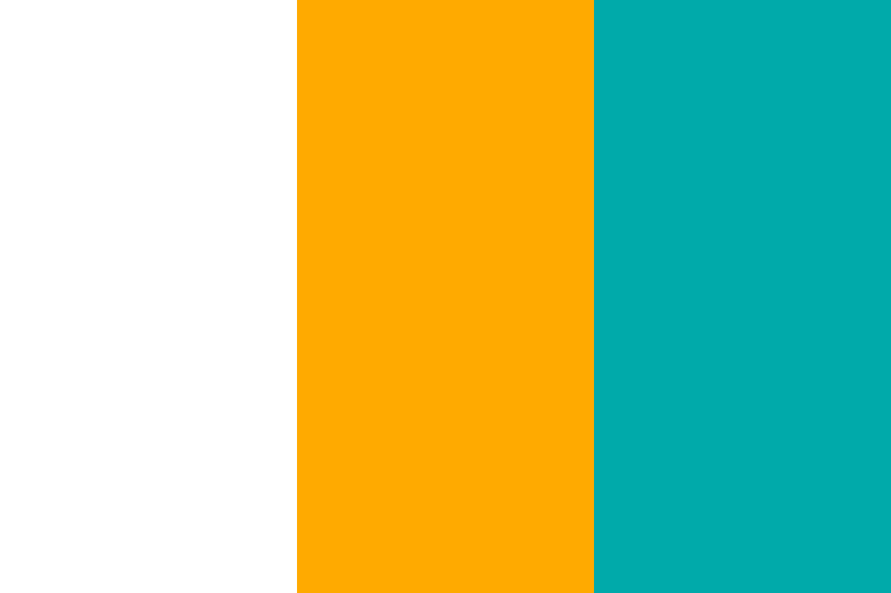

# Tricolor Clock

Each 12-hour clock time is a tricolor flag — H:MM

### Digits

           

Colors 10 and 11 are only used for the hour, never for the minutes. Hour 0 stands in for 12.

### Examples

| 6:29 | 10:51 | 12:37 |
| ---- | ---- | ---- |
|  |  |  |

### ▶ [Live preview](https://htmlpreview.github.io/?https://github.com/gatewaycat/color-clock/blob/main/index.html)
