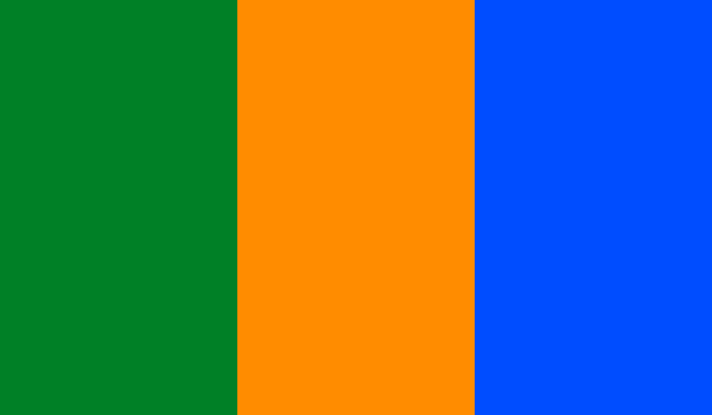
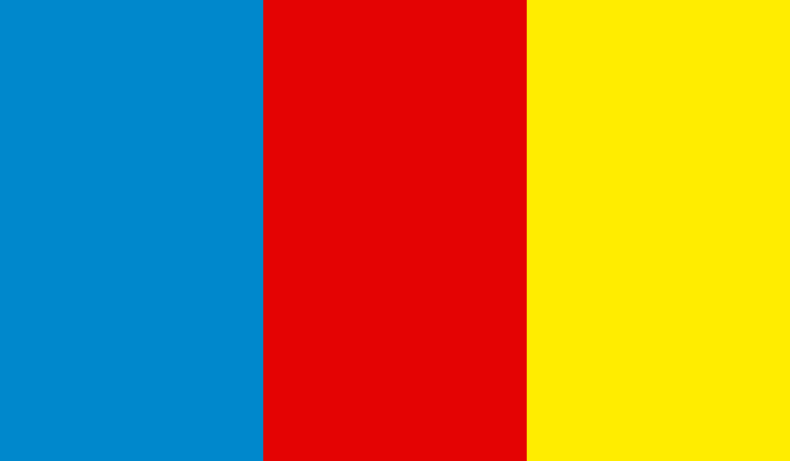
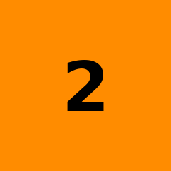
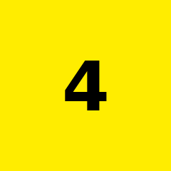

# color-clock

One twelve color clock, three vertical bands.

- The first band is the hour, 0 through b (11), the same color for am and pm.
- The second band is the tens of the minutes, 0 through 5.
- The third band is the ones of the minutes, 0 through 9.

The minute bands use the same colors as the hour band, just never 10 (a) or 11 (b), so a color is always the same digit.

### Examples 629 a51 804

  

629 is 06:29 or 18:29, a51 is 10:51 or 22:51, and 804 is 08:04 or 20:04.

### The twelve colors 0 through b

           

Only the hour band ever shows a or b.

### Live preview

https://htmlpreview.github.io/?https://github.com/gatewaycat/color-clock/blob/main/index.html
